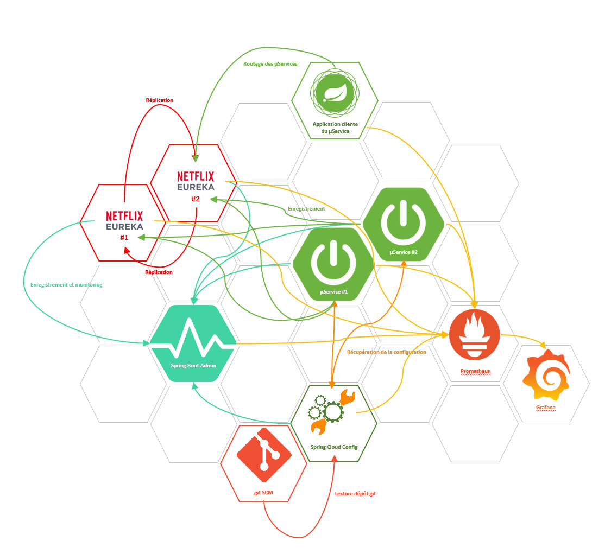

[](https://www.codefactor.io/repository/github/dvanderstoken/springsandbox)
[](https://dependabot.com)
[](https://github.com/DVanderstoken/springSandbox/issues)


# Spring / Spring Boot / Spring Cloud sandbox projects

### Big picture



What you can find :
- stand-alone Spring based applications
- Service discovery with [Eureka](https://spring.io/projects/spring-cloud-netflix#overview) (Spring Cloud Netflix)
- Spring Boot applications monitoring with [Spring Boot Admin](https://docs.spring-boot-admin.com/3.4.1/getting-started.html)
- Spring Boot applications monitoring with [Micrometer](https://micrometer.io/), [Prometheus](https://prometheus.io/) and [Grafana](https://grafana.com/)
- [Circuit breaker Pattern](https://spring.io/guides/gs/cloud-circuit-breaker) for microservices


### Run projects

#### Prerequisites

- _Git_
- _Docker_ (_Desktop_ for Windows and Mac, _Engine_ for Linux) with 4Gb of allocated memory
- _Docker Compose_
- _JDK_ 8+
- _Maven_ 3+

#### with Docker:

```
mvn clean package [-DskipTests]
docker-compose up --build
```

Use *compatibility* mode if you're not using Docker Swarm : 

```
docker-compose --compatibility up --build
```


| Module                          | Port  | URL                                                                                                                                                           |
| ------------------------------- | ----- | ------------------------------------------------------------------------------------------------------------------------------------------------------------- |
| Spring Boot Admin               | 10100 | http://localhost:10100                                                                                                                                        |
| Spring Cloud NetFlix Eureka #1  | 10300 | http://localhost:10300                                                                                                                                        |
| Spring Cloud NetFlix Eureka #2  | 10301 | http://localhost:10301                                                                                                                                        |
| Spring Boot µService #1         | 10500 | http://localhost:10500/api/v1/countries                                                                                                                       |
| Spring Boot µService #2         | 10501 | http://localhost:10501/api/v1/countries                                                                                                                       |
| Spring Boot Application backend | 10600 | http://localhost:10600/api/v1/countries, http://localhost:10600/api/v1/players                                                                                |
| Spring Cloud Config Server      | 10800 | http://localhost:10800/geolocation/dockerpeer1/docker                                                                                                         |
| Prometheus                      | 9090  | http://localhost:9090/targets                                                                                                                                 |
| Grafana                         | 3000  | http://localhost:3000/d/FlrrxiHMk/spring-sandbox-dashboard                                                                                                                                         |
